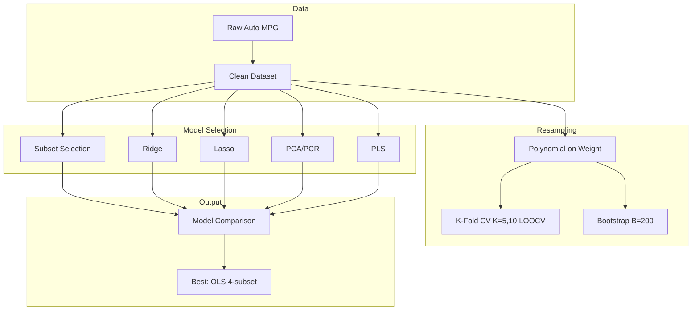

# Applied Machine Learning - Course Project 3: Resampling and Model Selection Methods

## Complete Project Documentation

**Purpose:** This document provides a comprehensive overview of the AML-P3 project for use in drafting the IEEE-format report (Overleaf) and the 5-minute presentation.

---

## 1. Executive Summary

| Item | Details |
|------|---------|
| **Project Title** | Course Project 3 — Resampling and Model Selection Methods |
| **Dataset** | UCI Auto MPG (Machine Learning Repository) |
| **Task** | Regression: Predict fuel efficiency (mpg) from car specifications |
| **Team Members** | Riyad Abdurrahmanov, Gabil Gurbanov |
| **Instructor** | Dr. Samir Rustamov |

**Key Findings:**

- **Resampling:** Best polynomial degree = 2 for all methods (K=5, K=10, LOOCV, Bootstrap)
- **Subset Selection:** Optimal 4 features (displacement, weight, model_year, origin) by cross-validation
- **Shrinkage:** Optimal λ ≈ 0.001 for both Ridge and Lasso
- **Best Model:** OLS with best 4-subset (CV RMSE 3.369, R² 0.8113)
- **PCA:** First principal component explains ~65.9% of variance; first 3 PCs exceed 95%
- **PLS vs PCR:** PLS reaches full OLS performance with fewer components than PCR

---

## 2. Motivation and Problem Setting

### 2.1 Problem

Predict miles per gallon (mpg) — a measure of fuel efficiency — from vehicle specifications. This is a classic regression problem in applied machine learning.

### 2.2 Dataset

- **Source:** UCI Machine Learning Repository (Auto MPG)
- **Original size:** 398 rows, 9 columns
- **After preprocessing:** 392 rows, 8 columns (6 rows dropped due to missing `horsepower`)

### 2.3 Features and Target

| Feature | Description |
|---------|-------------|
| cylinders | Number of cylinders |
| displacement | Engine displacement (cubic inches) |
| horsepower | Engine horsepower |
| weight | Vehicle weight (lbs) |
| acceleration | Time to accelerate 0–60 mph (seconds) |
| model_year | Model year (mod 100, e.g., 70–82) |
| origin | Origin (1=USA, 2=Europe, 3=Japan) |
| **mpg** | **Target:** Miles per gallon |

### 2.4 Preprocessing

- Dropped rows with missing `horsepower` (6 rows)
- Dropped `car_name` column (non-numeric)
- Standardized all features using `StandardScaler` for model selection and shrinkage methods

---

## 3. Part 1: Resampling Methods (40%)

### 3.1 Methodology

**Polynomial Regression Setup:**

- Single feature: **weight** (highest correlation with mpg)
- Pipeline: `PolynomialFeatures` → `StandardScaler` → `LinearRegression`
- Polynomial degrees evaluated: 1 through 8

**Cross-Validation:**

- **K=5:** 5-fold CV, shuffled, random_state=42
- **K=10:** 10-fold CV, shuffled, random_state=42
- **LOOCV:** Leave-One-Out (K = n = 392)

**Bootstrap:**

- B = 200 bootstrap samples
- Each sample: draw n observations with replacement
- Evaluation: out-of-bag (OOB) samples as test set

### 3.2 Results

**Cross-Validation MSE by Degree:**

| Degree | K=5 CV MSE | K=10 CV MSE | LOOCV MSE |
|--------|------------|-------------|-----------|
| 1 | 18.927 | 18.840 | 18.852 |
| 2 | **17.574** | **17.519** | **17.525** |
| 3 | 17.610 | 17.574 | 17.578 |
| 4 | 17.626 | 17.602 | 17.623 |
| 5 | 17.691 | 17.609 | 17.628 |
| 6 | 17.772 | 17.724 | 17.694 |
| 7 | 17.771 | 17.746 | 17.667 |
| 8 | 17.757 | 17.805 | 17.765 |

**Best degree:** 2 for all three CV methods.

**Bootstrap MSE by Degree:**

| Degree | Bootstrap MSE | Bootstrap Std |
|--------|---------------|---------------|
| 1 | 18.751 | 2.091 |
| 2 | **17.449** | 2.131 |
| 3 | 17.526 | 2.137 |
| 4 | 17.604 | 2.139 |
| 5 | 17.650 | 2.152 |
| 6 | 17.775 | 2.100 |
| 7 | 17.777 | 2.122 |
| 8 | 18.004 | 2.240 |

**Best degree (Bootstrap):** 2 (MSE = 17.45 ± 2.13)

### 3.3 Plots

| File | Description |
|------|-------------|
| `cv_mse_polynomial.png` | CV MSE vs polynomial degree for K=5, K=10, LOOCV; shows best degree = 2 |
| `resampling_comparison.png` | Left: all CV methods; Right: Bootstrap MSE with error bars (±1 std) |

---

## 4. Part 2: Model Selection (40%)

### 4.1 Subset Selection

**Methods:**

- **Best Subset:** Exhaustive search over all subsets of size k for k = 1, …, 7
- **Forward Stepwise:** Add one feature at a time by AIC
- **Backward Stepwise:** Remove one feature at a time by AIC

**Model Selection Criteria:**

- Mallow's Cp (minimize)
- AIC (minimize)
- BIC (minimize)
- Adjusted R² (maximize)
- 10-fold CV MSE (minimize)

**Best Subset by Number of Predictors (k):**

| k | AIC | BIC | Cp | Adj R² | CV MSE | Selected Features |
|---|-----|-----|-----|--------|--------|-------------------|
| 1 | 2263.9 | 2271.9 | 18.73 | 0.692 | 18.84 | weight |
| 2 | 2081.1 | 2093.0 | 11.77 | 0.807 | 11.81 | weight, model_year |
| 3 | 2063.7 | 2079.6 | 11.26 | 0.816 | 11.38 | weight, model_year, origin |
| 4 | 2064.3 | 2084.2 | 11.28 | 0.816 | **11.35** | displacement, weight, model_year, origin |
| 5 | 2062.1 | 2086.0 | 11.22 | 0.818 | 11.40 | displacement, horsepower, weight, model_year, origin |
| 6 | 2061.6 | 2089.4 | 11.21 | 0.818 | 11.37 | cylinders, displacement, horsepower, weight, model_year, origin |
| 7 | 2062.9 | 2094.7 | 11.24 | 0.818 | 11.45 | all features |

**Optimal by CV:** k = 4 predictors — displacement, weight, model_year, origin (CV MSE = 11.353)

**Plots:**

- `subset_selection.png`: AIC, BIC, Cp, Adjusted R² vs number of predictors (Best Subset, Forward, Backward)
- `subset_cv.png`: 10-fold CV MSE vs number of predictors with optimal k highlighted

### 4.2 Shrinkage Methods (Ridge and Lasso)

**Formulation:**

- **Ridge (L2):** Minimize RSS + λΣβ² — shrinks all coefficients toward zero, none exactly zero
- **Lasso (L1):** Minimize RSS + λΣ|β| — can produce sparse solutions (exact zeros)

**Optimal λ Selection:** 10-fold cross-validation via `RidgeCV` and `LassoCV`

**Results:**

- **Optimal Ridge λ:** 0.001
- **Optimal Lasso λ:** 0.001

**Coefficients at Optimal λ:**

| Feature | OLS | Ridge | Lasso |
|---------|-----|-------|-------|
| cylinders | -0.8405 | -0.8405 | -0.8194 |
| displacement | 2.0793 | 2.0791 | 2.0335 |
| horsepower | -0.6516 | -0.6517 | -0.6439 |
| weight | -5.4921 | -5.4919 | -5.4783 |
| acceleration | 0.2220 | 0.2220 | 0.2192 |
| model_year | 2.7621 | 2.7621 | 2.7606 |
| origin | 1.1473 | 1.1473 | 1.1426 |

**Plots:**

- `shrinkage_coef_paths.png`: Ridge and Lasso coefficient paths vs λ (log scale)
- `bias_variance_tradeoff.png`: Train MSE vs Test MSE vs λ for Ridge and Lasso; shows bias-variance tradeoff
- `coefficient_comparison.png`: Bar chart comparing OLS, Ridge, Lasso coefficients at optimal λ

### 4.3 Principal Component Analysis (PCA) and Partial Least Squares (PLS)

**PCA Variance Explained:**

| Component | Variance Explained | Cumulative |
|-----------|-------------------|------------|
| PC1 | 65.89% | 65.89% |
| PC2 | 13.43% | 79.32% |
| PC3 | 10.63% | 89.95% |
| PC4 | 6.88% | 96.83% |
| PC5 | 1.85% | 98.68% |
| PC6 | 0.85% | 99.52% |
| PC7 | 0.48% | 100% |

**First 3 PCs explain >95% of variance.**

**PCR vs PLS: MSE vs Number of Components (10-fold CV):**

| # Components | PCR MSE | PLS MSE |
|--------------|---------|---------|
| 1 | 16.988 | 15.728 |
| 2 | 16.942 | 12.818 |
| 3 | 13.247 | 12.109 |
| 4 | 13.164 | 11.720 |
| 5 | 12.655 | 11.630 |
| 6 | 11.796 | 11.456 |
| 7 | 11.452 | 11.452 |

**Interpretation:** PLS reaches OLS-level performance (MSE ≈ 11.45) with fewer components than PCR because PLS is supervised (uses both X and y) while PCR is unsupervised (uses only X).

**Plots:**

- `pca_variance.png`: Bar chart of variance explained per component; line chart of cumulative variance
- `pcr_pls_comparison.png`: PCR and PLS MSE vs number of components, with OLS baseline
- `pca_biplot.png`: PC1 vs PC2 scatter colored by MPG, with feature loading arrows

---

## 5. Part 3: Model Comparison

### 5.1 Final Model Summary (10-fold CV)

| Model | CV MSE | CV RMSE | CV R² |
|-------|--------|---------|-------|
| OLS (all features) | 11.452 | 3.384 | 0.8085 |
| **OLS (best 4 subset)** | **11.353** | **3.369** | **0.8113** |
| Ridge (optimal λ) | 11.452 | 3.384 | 0.8085 |
| Lasso (optimal λ) | 11.451 | 3.384 | 0.8085 |
| PCR (7 comp) | 11.452 | 3.384 | 0.8085 |
| PLS (7 comp) | 11.452 | 3.384 | 0.8085 |

**Best Model:** OLS with best 4-subset (displacement, weight, model_year, origin) — slightly lower RMSE (3.369) and higher R² (0.8113) than full OLS and regularized/dimension-reduced models.

**Plot:** `model_comparison.png` — horizontal bar charts of CV RMSE and CV R² for all six models.

---

## 6. Streamlit UI (Extra Task — 20%)

### 6.1 Overview

A clean, user-friendly Streamlit application provides interactive exploration of all methods and results.

**Run command:** `streamlit run streamlit_app.py`

### 6.2 Pages

| Page | Description |
|------|-------------|
| **Overview & EDA** | Dataset preview, feature distributions, correlation heatmap, scatter plots (feature vs MPG) |
| **Resampling Methods** | Select feature, max degree, B; run K=5, K=10, LOOCV, Bootstrap; MSE vs degree plots; detailed MSE table |
| **Subset Selection** | Run best/forward/backward; AIC, BIC, Cp, Adj R² vs k; CV MSE vs k; optimal feature list |
| **Shrinkage (Ridge/Lasso)** | Test size, λ range; coefficient paths; bias-variance tradeoff; OLS vs Ridge vs Lasso coefficient comparison |
| **PCA & PLS** | Variance explained; PCR vs PLS vs OLS MSE; PCA biplot (PC1 vs PC2, colored by MPG) |
| **Model Comparison** | Run all 6 models; RMSE and R² bar charts; best model; actual vs predicted scatter |
| **Live Prediction Lab** | Car specs input (presets: 70s V8, 80s economy, etc.); choose algorithm; predict MPG; feature contributions; compare across models |

### 6.3 Design

- Dark theme (background #0f1117, cards #1a2035)
- Metric cards for key numbers
- Section headers with gradient styling
- Interactive parameters (sliders, selectors, buttons)
- Data loaded from UCI URL with synthetic fallback if offline

---

## 7. File Inventory

### 7.1 Project Files

| File | Description |
|------|-------------|
| `project3_autompg.ipynb` | Main Jupyter notebook: data loading, preprocessing, resampling, model selection, PCA/PLS, model comparison |
| `streamlit_app.py` | Streamlit interactive UI (7 pages) |
| `instructions.md` | Assignment instructions |
| `auto-mpg.csv` | Raw UCI Auto MPG data |
| `auto_mpg_clean.csv` | Cleaned dataset (392 rows, no car_name) |
| `results.json` | Saved numerical results (CV MSE, bootstrap, subset metrics, optimal λ, PCA, model summary) |
| `submission.csv` | Submission file (ID, LABEL columns) |

### 7.2 Output Plots (14 PNG files)

| File | Content |
|------|---------|
| `scatter_plots.png` | Feature vs MPG scatter plots |
| `correlation_heatmap.png` | Feature correlation matrix |
| `cv_mse_polynomial.png` | CV MSE vs polynomial degree |
| `resampling_comparison.png` | CV vs Bootstrap MSE comparison |
| `subset_selection.png` | AIC, BIC, Cp, Adj R² vs # predictors |
| `subset_cv.png` | CV error vs # predictors |
| `shrinkage_coef_paths.png` | Ridge/Lasso coefficient paths |
| `bias_variance_tradeoff.png` | Train/test MSE vs λ |
| `coefficient_comparison.png` | OLS vs Ridge vs Lasso coefficients |
| `pca_variance.png` | PCA variance explained |
| `pcr_pls_comparison.png` | PCR vs PLS vs OLS MSE |
| `pca_biplot.png` | PCA biplot (PC1 vs PC2) |
| `model_comparison.png` | Final model RMSE and R² |

---

## 8. Report and Presentation Mapping

### 8.1 IEEE Report Structure (5 pages max)

| Section | Content |
|---------|---------|
| **Abstract** | Problem, methods, key results (best degree 2, best 4-subset, RMSE 3.369) |
| **I. Introduction / Motivation** | Predict MPG from car specs; UCI Auto MPG; 392 samples, 7 features |
| **II. Method** | Resampling (CV, Bootstrap), subset selection (Cp, AIC, BIC, Adj R², CV), shrinkage (Ridge, Lasso), PCA, PLS |
| **III. Experiments** | Setup (degrees 1–8, B=200, K=5/10/LOOCV); tables of MSE, subset metrics, model comparison |
| **IV. Results and Discussion** | Best degree 2; optimal 4 features; λ≈0.001; OLS best 4 slightly best; PLS vs PCR |
| **V. Conclusion** | Summary; contributions; possible extensions |
| **Appendix** | Figures (plots); team members' contributions |

### 8.2 Suggested Presentation Slides (5 min + 5 min Q&A)

| Slide | Content |
|-------|---------|
| 1 | Title, team (Riyad Abdurrahmanov, Gabil Gurbanov), instructor (Dr. Samir Rustamov), dataset |
| 2 | Problem: predict MPG; dataset overview |
| 3 | Resampling: CV (K=5,10,LOOCV) + Bootstrap; best degree = 2; show `resampling_comparison.png` |
| 4 | Subset selection: Cp, AIC, BIC, CV; optimal 4 features; show `subset_cv.png` |
| 5 | Shrinkage: Ridge/Lasso; optimal λ; show `bias_variance_tradeoff.png` |
| 6 | PCA/PLS: variance explained; PCR vs PLS; show `pcr_pls_comparison.png` |
| 7 | Model comparison: best = OLS best 4; show `model_comparison.png` |
| 8 | Streamlit UI demo (screenshot or live) |
| 9 | Conclusion and Q&A |

### 8.3 Key Figures to Include in Report

1. `resampling_comparison.png` — Resampling methods
2. `subset_selection.png` or `subset_cv.png` — Subset selection
3. `bias_variance_tradeoff.png` — Shrinkage
4. `pcr_pls_comparison.png` — PCA/PLS
5. `model_comparison.png` — Final comparison

---

## Appendix: Workflow Diagram

---

*Document generated for Course Project 3 — Resampling and Model Selection Methods. Use this as the primary reference when writing the IEEE report and preparing the presentation.*
