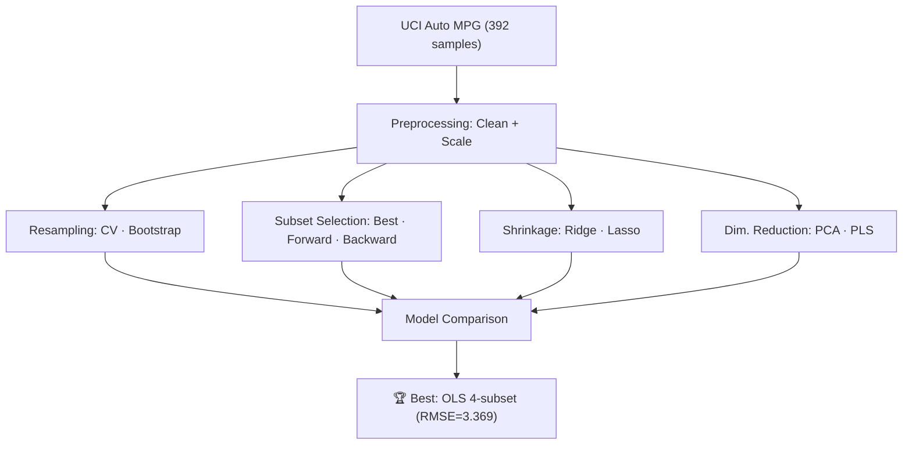

# Resampling & Model Selection for Fuel Efficiency Prediction

> **Applied Machine Learning — Course Project 3**  
> Riyad Abdurahimov · Gabil Gurbanov  
> Instructor: Dr. Samir Rustamov

[](https://archive.ics.uci.edu/ml/machine-learning-databases/auto-mpg/)
[](https://python.org)
[](https://streamlit.io)

This project applies **resampling** and **model selection** techniques to predict vehicle fuel efficiency (MPG) from engineering specifications using the [UCI Auto MPG dataset](https://archive.ics.uci.edu/ml/machine-learning-databases/auto-mpg/). We systematically compare **cross-validation**, **bootstrap**, **subset selection**, **Ridge/Lasso regularization**, **PCA**, and **PLS** — identifying the best-performing model and visualizing the bias–variance tradeoff at each step.

---

## Key Results

| Method | Best Configuration | Performance |
|---|---|---|
| **Resampling** | Polynomial degree 2 on weight | MSE = 17.52 (all CV methods agree) |
| **Subset Selection** | 4 features: displacement, weight, model_year, origin | CV MSE = 11.35 |
| **Shrinkage** | λ = 0.001 (Ridge & Lasso) | Coefficients ≈ OLS |
| **PCA/PLS** | PLS reaches OLS with fewer components than PCR | MSE ≈ 11.45 at 6 comp |
| **🏆 Best Model** | **OLS with 4-feature subset** | **RMSE = 3.369, R² = 0.8113** |

---

## Table of Contents

- [Quick Start](#quick-start)
- [Project Overview](#project-overview)
- [Dataset](#dataset)
- [Methodology & Results](#methodology--results)
  - [Resampling Methods](#1-resampling-methods)
  - [Subset Selection](#2-subset-selection)
  - [Shrinkage Methods](#3-shrinkage-methods-ridge--lasso)
  - [PCA & PLS](#4-pca--pls)
  - [Model Comparison](#5-final-model-comparison)
- [Interactive Dashboard](#interactive-dashboard)
- [Project Structure](#project-structure)
- [Visualizations](#visualizations)
- [References](#references)

---

## Quick Start

```bash
# Clone the repository
git clone https://github.com/ggurbanov12098/AppliedML-P3.git
cd AppliedML-P3

# Install dependencies (scikit-learn, statsmodels, pandas, streamlit, matplotlib)
pip install scikit-learn statsmodels pandas streamlit matplotlib seaborn

# Launch the interactive dashboard
streamlit run streamlit_app.py

# Or explore the Jupyter notebook
jupyter notebook AML-P3.ipynb
```

---

## Project Overview

Predicting fuel efficiency from vehicle specifications is a classic regression problem. The challenge lies in balancing model complexity against generalization:

- **Too complex** → overfitting (high variance, low bias)
- **Too simple** → underfitting (low variance, high bias)

This project systematically evaluates techniques from **Chapter 5–6 of ISLR** to find the sweet spot:



---

## Dataset

**Source:** [UCI Machine Learning Repository — Auto MPG](https://archive.ics.uci.edu/ml/machine-learning-databases/auto-mpg/)

| Property | Detail |
|---|---|
| Original size | 398 rows × 9 columns |
| After cleaning | 392 rows × 8 columns |
| Dropped | 6 rows (missing `horsepower`), `car_name` column |
| Scaling | `StandardScaler` (zero mean, unit variance) |

### Features

| Feature | Description | Type |
|---|---|---|
| `cylinders` | Number of cylinders | Discrete |
| `displacement` | Engine displacement (cu. in.) | Continuous |
| `horsepower` | Engine horsepower | Continuous |
| `weight` | Vehicle weight (lbs) | Continuous |
| `acceleration` | Time to 0–60 mph (sec) | Continuous |
| `model_year` | Model year (70–82) | Discrete |
| `origin` | Origin: 1=USA, 2=Europe, 3=Japan | Categorical |
| **`mpg`** | **Miles per gallon (Target)** | **Continuous** |

**Weight** has the strongest negative correlation with MPG (−0.83), making it the primary feature for polynomial resampling experiments.

---

## Methodology & Results

### 1. Resampling Methods

We evaluate polynomial regression (degrees 1–8) on **weight** using four resampling strategies:

- **K-Fold CV** (K=5, K=10) — shuffled, `random_state=42`
- **LOOCV** — Leave-One-Out (K = n = 392)
- **Bootstrap** — B=200 replications with OOB evaluation

| Degree | K=5 MSE | K=10 MSE | LOOCV MSE | Bootstrap MSE |
|:---:|:---:|:---:|:---:|:---:|
| 1 | 18.93 | 18.84 | 18.85 | 18.75 ± 2.09 |
| **2** | **17.57** | **17.52** | **17.52** | **17.45 ± 2.13** |
| 3 | 17.61 | 17.57 | 17.58 | 17.53 ± 2.14 |
| 4 | 17.63 | 17.60 | 17.62 | 17.60 ± 2.14 |
| 5 | 17.69 | 17.61 | 17.63 | 17.65 ± 2.15 |
| 6 | 17.77 | 17.72 | 17.69 | 17.78 ± 2.10 |
| 7 | 17.77 | 17.75 | 17.67 | 17.78 ± 2.12 |
| 8 | 17.76 | 17.81 | 17.76 | 18.00 ± 2.24 |

> **Finding:** All four methods unanimously select **degree 2** as optimal. Higher degrees increase complexity without improving test error — a clear sign of overfitting.

### 2. Subset Selection

We evaluate all subsets of size *k* = 1…7 using five criteria: **Mallow's Cₚ**, **AIC**, **BIC**, **Adjusted R²**, and **10-fold CV MSE**.

| k | AIC | BIC | Cₚ | Adj R² | CV MSE | Selected Features |
|:---:|:---:|:---:|:---:|:---:|:---:|---|
| 1 | 2263.9 | 2271.9 | 18.73 | 0.692 | 18.84 | weight |
| 2 | 2081.1 | 2093.0 | 11.77 | 0.807 | 11.81 | weight, model_year |
| 3 | 2063.7 | 2079.6 | 11.26 | 0.816 | 11.38 | weight, model_year, origin |
| **4** | 2064.3 | 2084.2 | 11.28 | 0.816 | **11.35** | **displacement, weight, model_year, origin** |
| 5 | 2062.1 | 2086.0 | 11.22 | 0.818 | 11.40 | + horsepower |
| 6 | 2061.6 | 2089.4 | 11.21 | 0.818 | 11.37 | + cylinders |
| 7 | 2062.9 | 2094.7 | 11.24 | 0.818 | 11.45 | all features |

> **Finding:** **k=4** minimizes CV MSE. The optimal subset — displacement, weight, model_year, origin — outperforms the full 7-feature model by removing redundant predictors (cylinders, horsepower, acceleration).

### 3. Shrinkage Methods (Ridge & Lasso)

Both methods use 10-fold CV (`RidgeCV`, `LassoCV`) to select the optimal regularization parameter.

| | Ridge (L2) | Lasso (L1) |
|---|:---:|:---:|
| **Optimal λ** | 0.001 | 0.001 |
| **Effect** | Shrinks all coefficients | Can zero out coefficients |
| **Result** | Coefficients ≈ OLS | Slight shrinkage on cylinders, displacement |

**Coefficients at optimal λ:**

| Feature | OLS | Ridge | Lasso |
|---|:---:|:---:|:---:|
| cylinders | −0.84 | −0.84 | −0.82 |
| displacement | 2.08 | 2.08 | 2.03 |
| horsepower | −0.65 | −0.65 | −0.64 |
| **weight** | **−5.49** | **−5.49** | **−5.48** |
| acceleration | 0.22 | 0.22 | 0.22 |
| model_year | 2.76 | 2.76 | 2.76 |
| origin | 1.15 | 1.15 | 1.14 |

> **Finding:** Very low λ = 0.001 means regularization adds minimal bias. Weight dominates with the largest (negative) coefficient, confirming its importance. The bias–variance tradeoff plots show test MSE increasing sharply at high λ.

### 4. PCA & PLS

| Components | PCR MSE | PLS MSE |
|:---:|:---:|:---:|
| 1 | 16.99 | 15.73 |
| 2 | 16.94 | 12.82 |
| 3 | 13.25 | 12.11 |
| 4 | 13.16 | 11.72 |
| 5 | 12.65 | 11.63 |
| 6 | 11.80 | 11.46 |
| 7 | 11.45 | 11.45 |

**PCA variance explained:** PC1 = 65.9%, PC2 = 13.4%, PC3 = 10.6% → first 3 components capture ~**90%** of total variance; first 4 exceed **96%**.

> **Finding:** PLS reaches OLS-level performance (MSE ≈ 11.45) with **fewer components** than PCR. This is because PLS is **supervised** — it considers the target variable when constructing latent components — while PCR relies only on feature variance.

### 5. Final Model Comparison

| Model | CV MSE | CV RMSE | CV R² |
|---|:---:|:---:|:---:|
| OLS (all 7 features) | 11.452 | 3.384 | 0.8085 |
| **OLS (best 4 subset)** | **11.353** | **3.369** | **0.8113** |
| Ridge (λ = 0.001) | 11.452 | 3.384 | 0.8085 |
| Lasso (λ = 0.001) | 11.451 | 3.384 | 0.8085 |
| PCR (7 components) | 11.452 | 3.384 | 0.8085 |
| PLS (7 components) | 11.452 | 3.384 | 0.8085 |

> **🏆 Winner: OLS with the 4-feature subset** achieves the lowest RMSE (3.369) and highest R² (0.8113). Removing cylinders, horsepower, and acceleration reduces noise without losing predictive power.

---

## Interactive Dashboard

An interactive **Streamlit** application provides full exploration of every method and result.

```bash
streamlit run streamlit_app.py
```

### Pages

| Page | What You Can Do |
|---|---|
| **📊 Overview & EDA** | Browse the dataset, distributions, correlation heatmap, feature scatter plots |
| **🔄 Resampling Methods** | Configure polynomial degree, K, B; run CV and bootstrap; view MSE curves |
| **🔍 Subset Selection** | Run best/forward/backward; compare AIC, BIC, Cₚ, Adj R²; find optimal features |
| **📈 Shrinkage** | Tune λ range; view coefficient paths; bias–variance tradeoff; compare OLS vs Ridge vs Lasso |
| **🧩 PCA & PLS** | Explore variance explained; PCR vs PLS vs OLS MSE; interactive biplot |
| **🏆 Model Comparison** | All 6 models side-by-side with RMSE, R² bar charts; actual vs predicted scatter |
| **🚗 Live Prediction Lab** | Pick car presets (70s V8, 80s economy, etc.) or enter custom specs; predict MPG; see feature contributions |

---

## Project Structure

```
AppliedML-P3/
├── AML-P3.ipynb              # Main Jupyter notebook (analysis & experiments)
├── streamlit_app.py           # Interactive Streamlit dashboard (7 pages)
├── README.md                  # This file
│
├── data/
│   ├── auto-mpg.csv           # Raw UCI dataset
│   ├── auto_mpg_clean.csv     # Cleaned dataset (392 rows)
│   ├── results.json           # Saved numerical results
│   └── submission.csv         # Submission file
│
├── visualizations/            # All generated plots (13 PNG files)
│   ├── correlation_heatmap.png
│   ├── scatter_plots.png
│   ├── cv_mse_polynomial.png
│   ├── resampling_comparison.png
│   ├── subset_selection.png
│   ├── subset_cv.png
│   ├── shrinkage_coef_paths.png
│   ├── bias_variance_tradeoff.png
│   ├── coefficient_comparison.png
│   ├── pca_variance.png
│   ├── pca_biplot.png
│   ├── pcr_pls_comparison.png
│   └── model_comparison.png
│
└── report-pptx/               # Deliverables
    ├── report.tex             # IEEE conference paper (LaTeX)
    ├── AML_P3_Report.pdf      # Compiled report
    ├── presentation.pptx      # Presentation slides
    └── figures/               # Figures used in the report
```

---

## Visualizations

All plots are saved in `visualizations/` and embedded in the report. Below is a summary:

| Plot | Shows |
|---|---|
| `correlation_heatmap.png` | Feature correlation matrix — weight is most correlated with MPG |
| `scatter_plots.png` | Each feature vs MPG scatter |
| `cv_mse_polynomial.png` | CV MSE vs polynomial degree (K=5, K=10, LOOCV) |
| `resampling_comparison.png` | CV methods + bootstrap MSE with error bars |
| `subset_selection.png` | AIC, BIC, Cₚ, Adj R² vs number of predictors |
| `subset_cv.png` | 10-fold CV MSE vs number of predictors |
| `shrinkage_coef_paths.png` | Ridge & Lasso coefficient paths vs log(λ) |
| `bias_variance_tradeoff.png` | Train MSE vs Test MSE vs λ |
| `coefficient_comparison.png` | OLS vs Ridge vs Lasso coefficients at optimal λ |
| `pca_variance.png` | Variance explained per component + cumulative |
| `pca_biplot.png` | PC1 vs PC2 scatter colored by MPG with loading arrows |
| `pcr_pls_comparison.png` | PCR vs PLS MSE vs # components with OLS baseline |
| `model_comparison.png` | Final RMSE and R² for all 6 models |

---

## References

1. D. Dua and C. Graff, "UCI Machine Learning Repository," 2019. [Link](https://archive.ics.uci.edu/ml/machine-learning-databases/auto-mpg/)
2. G. James, D. Witten, T. Hastie, and R. Tibshirani, *An Introduction to Statistical Learning with Applications in R*, 2nd ed. Springer, 2021.
3. T. Hastie, R. Tibshirani, and J. Friedman, *The Elements of Statistical Learning*, 2nd ed. Springer, 2009.
4. F. Pedregosa et al., "Scikit-learn: Machine Learning in Python," *J. Mach. Learn. Res.*, vol. 12, pp. 2825–2830, 2011.

---

<p align="center">
  <b>Applied Machine Learning — Course Project 3</b><br>
  Riyad Abdurahimov · Gabil Gurbanov · Instructor: Dr. Samir Rustamov
</p>
